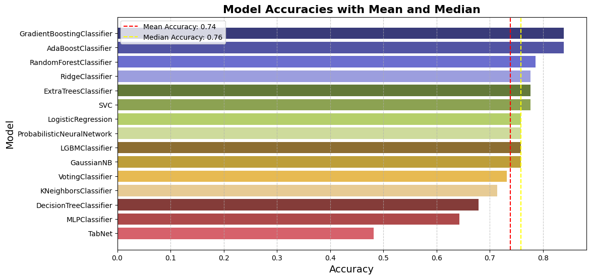

# 🧠 OASIS-2 Data Analysis & Training

  

Welcome to my AI Project! This repository is dedicated to exploring and modeling Alzheimer's Disease (AD) using the [OASIS-2 dataset](https://sites.wustl.edu/oasisbrains/home/oasis-2/), a rich collection of longitudinal brain MRI data from older adults. The project is split into two main parts:

- 📊 **data-analysis_oasis2.ipynb**: For data exploration, cleaning and preprocessing.
- 🤖 **data-training_oasis2.ipynb**: For model training, evaluation and comparison.

## 📁 Project Structure
### **data-analysis_oasis2.ipynb**
This notebook performs an in-depth analysis and preprocessing of the OASIS-2 dataset.
- 🧹 Data cleaning and handling of missing values
- 🔍 Feature engineering and selection
- 📈 Exploratory data analysis  including visualizations
- 🧠 Preparation for machine learning tasks

### **data-training_oasis2.ipynb**
In this notebook, we train and evaluate 15 classification models to predict cognitive states.

🛠️ Models included:
- Logistic Regression
- Ridge Classifier
- Decision Tree Classifier
- Extra Trees Classifier
- Random Forest Classifier
- Support Vector Machine (SVM)
- Multi-Layer Perceptron (MLP)
- Probabilistic Neural Network (PNN)
- LightGBM Classifier (LGBM)
- Gradient Boosting Classifier
- AdaBoost Classifier
- Gaussian Naive Bayes (GNB)
- K-Nearest Neighbours (KNN)
- Voting Classifier
- TabNet

Each model is evaluated using standard classification metrics and final comparisons help identify the best-performing algorithm

## 🧬 About the OASIS-2 Dataset
OASIS-2 (Open Access Series of Imaging Studies) is a public dataset providing longitudinal MRI data of adults aged 60–96 years. It focuses on both nondemented and demented individuals, offering insights into the progression of Alzheimer’s disease and other forms of cognitive decline.

🔎 Key Details:
- 150 participants
- Minimum 2 visits per participant, at least 1 year apart
- 373 total MRI sessions
- Data includes aging adults, all right-handed
- 72 remained nondemented, 64 had dementia (mostly Alzheimer’s), 14 converted to dementia over time

## 🚀 Getting Started
To run the notebooks:
1. Get access to the Oasis-2 dataset
2. Clone this repository
3. Install dependencies
4. Download Oasis-2 dataset and extract the csv
5. Run each notebook step-by-step in order
   - Start with data-analysis_oasis2.ipynb
   - Then proceed to data-training_oasis2.ipynb

## 🤝 Contributing
Contributions, suggestions and improvements are welcome! Feel free to fork, raise issues, or submit pull requests. 💡

## 📜 License
This project is released under the MIT License. See the LICENSE file for details.
